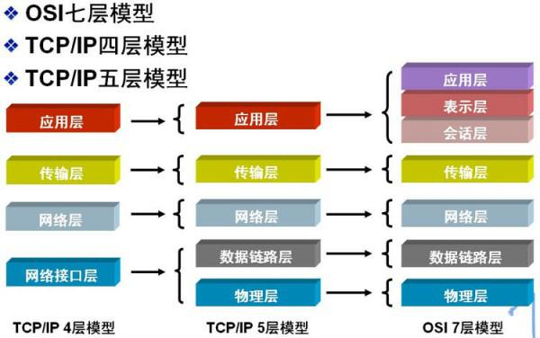

# OSI(开放系统互联参考模型)
## 七层协议
-  图示


- OSI 七层模型通过七个层次化的结构模型使不同的系统不同的网络之间实现可靠的通讯，因此其最主要的功能就是帮助不同类型的主机实现数据传输 。完成中继功能的节点通常称为中继系统。一个设备工作在哪一层，关键看它工作时利用哪一层的数据头部信息。网桥工作时，是以MAC头部来决定转发端口的，因此显然它是数据链路层的设备。具体说:
    ```
    物理层：网卡，网线，集线器，中继器，调制解调器
    数据链路层：网桥，交换机
    网络层：路由器
    网关工作在第四层传输层及其以上
    ```
- 集线器是物理层设备,采用广播的形式来传输信息。
- 交换机就是用来进行报文交换的机器。多为链路层设备(二层交换机)，能够进行地址学习，采用存储转发的形式来交换报文。
- 路由器的一个作用是连通不同的网络，另一个作用是选择信息传送的线路。选择通畅快捷的近路，能大大提高通信速度，减轻网络系统通信负荷，节约网络系统资源，提高网络系统畅通率。 

### 交换机
    交换机拥有一条很高带宽的内部总线和内部交换矩阵。交换机的所有的端口都挂接在这条总线上，
    控制电路收到数据包以后，处理端口会查找内存中的地址对照表以确定目的MAC（网卡的硬件地址）的NIC（网卡）挂接在哪个端口上，
    通过内部交换矩阵迅速将数据包传送到目的端口，目的MAC若不存在则广播到所有的端口，接收端口回应后交换机会“学习”新的地址，
    并把它添加入内部MAC地址表中。 使用交换机也可以把网络“分段”，通过对照MAC地址表，交换机只允许必要的网络流量通过交换机。
    通过交换机的过滤和转发，可以有效的隔离广播风暴，减少误包和错包的出现，避免共享冲突。 
    交换机在同一时刻可进行多个端口对之间的数据传输。每一端口都可视为独立的网段，连接在其上的网络设备独自享有全部的带宽，
    无须同其他设备竞争使用。当节点A向节点D发送数据时，节点B可同时向节点C发送数据，而且这两个传输都享有网络的全部带宽，
    都有着自己的虚拟连接。总之，交换机是一种基于MAC地址识别，能完成封装转发数据包功能的网络设备。交换机可以"学习"MAC地址，
    并把其存放在内部地址表中，通过在数据帧的始发者和目标接收者之间建立临时的交换路径，使数据帧直接由源地址到达目的地址。
    
### 集线器
    集线器的英文称为“Hub”。集线器的主要功能是对接收到的信号进行再生整形放大，以扩大网络的传输距离，
    同时把所有节点集中在以它为中心的节点上。它工作于OSI(开放系统互联参考模型)参考模型第一层，即“物理层”。
    集线器与网卡、网线等传输介质一样，属于局域网中的基础设备，
    采用 CSMA/CD（即带冲突检测的载波监听多路访问技术)介质访问控制机制。
    集线器每个接口简单的收发比特，收到1就转发1，收到0就转发0，不进行碰撞检测。
    集线器属于纯硬件网络底层设备，基本上不具有类似于交换机的"智能记忆"能力和"学习"能力。
    它也不具备交换机所具有的MAC地址表，所以它发送数据时都是没有针对性的，而是采用广播方式发送。
    也就是说当它要向某节点发送数据时，不是直接把数据发送到目的节点，而是把数据包发送到与集线器相连的所有节点。
    HUB是一个多端口的转发器，当以HUB为中心设备时，网络中某条线路产生了故障，并不影响其它线路的工作。
    所以HUB在局域网中得到了广泛的应用。 大多数的时候它用在星型与树型网络拓扑结构中。

### 集线器的交换机的区别
    首先说HUB,也就是集线器。它的作用可以简单的理解为将一些机器连接起来组成一个局域网。
    而交换机（又名交换式集线器）作用与集线器大体相同。但是两者在性能上有区别：
    集线器采用的是共享带宽的工作方式，而交换机是独享带宽。这样在机器很多或数据量很大时，两者将会有比较明显的。
    工作位置不同。集线器工作在物理层，而交换机工作在数据链路层。
    工作方式不同。集线器是一种广播方式，当集线器的某个端口工作时其他端口都能收听到信息。交换机工作时端口互不影响。
    带宽不同。集线器是所有端口共享一条带宽，在同一时刻只能有两个端口传输数据；而交换机每个端口独占一条带宽。
    性能不同。交换机以MAC地址进行寻址，有一定额外的寻址开销；集线器以广播方式传输数据，流量小时性能下降不明显，适用于共享总线的局域网。
    
### 路由器与交换机的区别
    总的来说，路由器与交换机的主要区别体现在以下几个方面： 
    （1）工作层次不同。最初的的交换机是工作在数据链路层，而路由器一开始就设计工作在网络层。由于交换机工作在数据链路层，
        所以它的工作原理比较简单，而路由器工作在网络层，可以得到更多的协议信息，路由器可以做出更加智能的转发决策。 
    （2）数据转发所依据的对象不同。交换机是利用物理地址或者说MAC地址来确定转发数据的目的地址。
        而路由器则是利用IP地址来确定数据转发的地址。IP地址是在软件中实现的，描述的是设备所在的网络。
        MAC地址通常是硬件自带的，由网卡生产商来分配的，而且已经固化到了网卡中去，一般来说是不可更改的。
        而IP地址则通常由网络管理员或系统自动分配。
    （3）传统的交换机只能分割冲突域，不能分割广播域；而路由器可以分割广播域。
        由交换机连接的网段仍属于同一个广播域，广播数据包会在交换机连接的所有网段上传播，在某些情况下会导致通信拥挤和安全漏洞。
        连接到路由器上的网段会被分配成不同的广播域，广播数据不会穿过路由器。虽然第三层以上交换机具有VLAN功能，
        也可以分割广播域，但是各子广播域之间是不能通信交流的，它们之间的交流仍然需要路由器。 
    （4）交换机负责同一个网段的通信，而路由器负责不同网段的通信。路由器提供了防火墙的服务。
        路由器仅仅转发特定地址的数据包，不传送不支持路由协议的数据包传送和未知目标网络数据包的传送，从而可以防止广播风暴。

### 物理层（Physical Layer）
    在OSI参考模型中，物理层（Physical Layer）是参考模型的最低层。物理层的作用是实现相邻计算机节点之间比特流的透明传送，
    尽可能屏蔽掉具体传输介质和物理设备的差异。“透明传送比特流”表示经实际电路传送后的比特流没有发生变化，对传送的比特流来说，
    这个电路好像是看不见的。
    
### 数据链路层（Data Link Layer）
    数据链路层（Data Link Layer）是OSI模型的第二层，负责建立和管理节点间的链路。该层的主要功能是：通过各种控制协议，
    将有差错的物理信道变为无差错的、能可靠传输数据帧的数据链路。在计算机网络中由于各种干扰的存在，物理链路是不可靠的。
    因此，这一层的主要功能是在物理层提供的比特流的基础上，通过差错控制、流量控制方法，使有差错的物理线路变为无差错的数据链路，
    即提供可靠的通过物理介质传输数据的方法。数据链路层的具体工作是接收来自物理层的位流形式的数据，并封装成帧，传送到上一层；
    同样，也将来自上层的数据帧，拆装为位流形式的数据转发到物理层；并且，还负责处理接收端发回的确认帧的信息，以便提供可靠的数据传输。
    
### 网络层（Network Layer）
    网络层（Network Layer）是OSI模型的第三层，它是OSI参考模型中最复杂的一层。它在下两层的基础上向资源子网提供服务。
    其主要任务是：通过路由选择算法，为报文或分组通过通信子网选择最适当的路径。具体地说，数据链路层的数据在这一层被转换为数据包，
    然后通过路径选择、分段组合、顺 序、进/出路由等控制，将信息从一个网络设备传送到另一个网络设备。
    一般地，数据链路层是解决同一网络内节点之间的通信，而网络层主要解决不同子网间的通信。例如在广域网之间通信时，
    必然会遇到路由（即两节点间可能有多条路径）选择问题。 
    
### 传输层（Transport Layer）
    传输层（Transport Layer）是OSI模型的第4层。因此该层是通信子网和资源子网的接口和桥梁，起到承上启下的作用。
    该层的主要任务是：向用户提供可靠的端到端的差错和流量控制，保证报文的正确传输。传输层的作用是向高层屏蔽下层数据通信的细节，
    即向用户透明地传送报文。该层常见的协议：TCP/IP中的TCP协议和UDP协议。传输层提供会话层和网络层之间的传输服务，
    这种服务从会话层获得数据，并在必要时，对数据进行分割。然后，传输层将数据传递到网络层，并确保数据能正确无误地传送到网络层。
    因此，传输层负责提供两节点之间数据的可靠传送，当两节点的联系确定之后，传输层则负责监督工作。
    综上，传输层的主要功能如下：监控服务质量。
    
### 会话层（Session Layer）
    会话层（Session Layer）是OSI模型的第5层，是用户应用程序和网络之间的接口，
    主要任务是：向两个实体的表示层提供建立和使用连接的方法。将不同实体之间的表示层的连接称为会话。
    因此会话层的任务就是组织和协调两个会话进程之间的通信，并对数据交换进行管理。 
    用户可以按照半双工、单工和全双工的方式建立会话。当建立会话时，用户必须提供他们想要连接的远程地址。
    而这些地址与MAC（介质访问控制子层）地址或网络层的逻辑地址不同，它们是为用户专门设计的，更便于用户记忆。
    
### 表示层（Presentation Layer）
    表示层（Presentation Layer）是OSI模型的第六层，它对来自应用层的命令和数据进行解释，
    对各种语法赋予相应的含义，并按照一定的格式传送给会话层。其主要功能是“处理用户信息的表示问题，
    如编码、数据格式转换和加密解密”等。
    
### 应用层（Application Layer）
    应用层（Application Layer）是OSI参考模型的最高层，它是计算机用户，以及各种应用程序和网络之间的接口，
    其功能是直接向用户提供服务，完成用户希望在网络上完成的各种工作。它在其他6层工作的基础上，
    负责完成网络中应用程序与网络操作系统之间的联系，建立与结束使用者之间的联系，
    并完成网络用户提出的各种网络服务及应用所需的监督、管理和服务等各种协议。此外，该层还负责协调各个应用程序间的工作。
    
### 图示


### 路由表
    路由表是指路由器或者其他互联网网络设备上存储的一张路由信息表，该表中存有到达特定网络终端的路径，
    在某些情况下，还有一些与这些路径相关的度量。路由器的主要工作就是为经过路由器的每个数据包寻找一条最佳的传输路径，
    并将该数据有效地传送到目的站点。由此可见，选择最佳路径的策略即路由算法是路由器的关键所在。
    为了完成这项工作，在路由器中保存着各种传输路径的相关数据——路由表（Routing Table），供路由选择时使用，
    表中包含的信息决定了数据转发的策略。路由表可以是由系统管理员固定设置好的，也可以由系统动态修改，
    可以由路由器自动调整，也可以由主机控制。

#### 静态路由表
    由系统管理员事先设置好固定的路由表称之为静态（static）路由表，一般是在系统安装时就根据网络的配置情况预先设定的，
    它不会随未来网络结构的改变而改变。

#### 动态路由表
- 动态（Dynamic）路由表是路由器根据网络系统的运行情况而自动调整的路由表。路由器根据路由选择协议（Routing Protocol）提供的功能，
- 自动学习和记忆网络运行情况，在需要时自动计算数据传输的最佳路径。
- 路由器通常依靠所建立及维护的路由表来决定如何转发。路由表能力是指路由表内所容纳路由表项数量的极限。路由表中的表项内容包括：
    ```
    destination mask pre costdestination：目的地址，用来标识IP包的目的地址或者目的网络。
    mask：网络掩码，与目的地址一起标识目的主机或者路由器所在的网段的地址。
    pre：标识路由加入IP路由表的优先级。可能到达一个目的地有多条路由，但是优先级的存在让他们先选择优先级高的路由进行利用。
    cost：路由开销，当到达一个目的地的多个路由优先级相同时，路由开销最小的将成为最优路由。
    interface：输出接口，说明IP包将从该路由器哪个接口转发。 
    nexthop：下一跳IP地址，说明IP包所经过的下一个路由器。
    ```
    
### 对OSI各个层次的理解

#### 案例：从西班牙去罗马的贸易商人
- 这一部分是对OSI七层模型理解的重点部分，这个情境的创设，能够通过层层结构理解为什么OSI目前设置为7个层次，并做出相应的解释。主要的方式为通过类比法，
- 用一个“西班牙去罗马的贸易商人”的情境设置体会到为什么要给网络分成这7个层次。主要的目的是知道这个参考模型存在的意义，但并不对每一层的详细功能做过多的介绍。
    ```
    1、要想贸易获得成功，首先要有至少一条路，能够从西班牙通向罗马。此层为物理层。
    2、有了路是不是就能去贸易了？还要保证路上不会把商人的货物给磕坏了，要有一层保护的包装。引出第二层，数据链路层。
    3、所谓条条道路通罗马。并不只有一条路能够到达罗马，那么在那么多的选择中选一条最短的，或者路费的成本最少的，这才符合商人的利益。引出第三层，网络层。
       以上三层为网络中的下三层，叫媒体层，让我们来看看另外4层。
    4、贸易出门前要先检查一下自己的货，有没有拿错了，事先要检查过，如果错了要重新取货，引出第四层，传输层。
    5、是不是可以上路了？还不行。我们要和罗马联系好， 如果我们这边的货物到了那边卖不出去怎么办？我们首先要交流、协商一下，
       看看罗马的市场情况，能和那边的另外一个商人合作的话就更好了，这就需要一些外交的关系。叫做会话层。
    6、好象所有的事情都准备好了，但是商人到了罗马以后突然发现，他的商队里没有人能听懂罗马人的话，罗马人也没有人能听懂西班牙语，
       这个时候，还需要一个翻译，要么把两种语言都转换成一种国际通用语言，比如说英语，要么至少能让双方能交流。这里就是表示层。
    7、到了罗马了，最终需要在交易所中把商品卖掉，这个交易所就是一个交易平台,相当于各个软件平台，引出最后一层，应用层。
    ```
    
- 这时，对OSI便有了一个大致的了解，能从基本上把握分层的原因和各个层次的特点。
- 这里通过几个分组讨论来加深对OSI的理解。
    ```
    1）、运用网络设备的知识，讨论哪些设备是分别属于下三层物理层的。
    2）、通过对在去罗马贸易的路途中可能出现的问题，比如说天气灾难、过期、被盗等等问题讨论如何加入某些协议，
      让整个贸易过程中得到一些有效的保护，使得贸易能够顺利的完成。通过对情境2的过程的理解和对此处协议的讨论，
      理解到协议在整个网络通信过程中的重要性及如何起到重要作用。
    ```
- 这里可以引出网络中关于协议最重要的一层为传输层。引出TCP协议的重要作用，并解释TCP协议在传输层的作用与在表示层中其他协议作用的区别。并让学生思考IP协议在哪一个网络层中起到作用。

### 网络协议的分层思想
#### 案例：下面案例中采用的思想是否与网络协议的分层思想相似
    建筑公司的老板打算与装潢公司合作向客户提供全套服务。老板指示他的法律部门调查此事，法律部门请求工程部门帮忙。
    于是总工程师打电话给装潢公司的工程部门主管讨论此事的技术问题。然后工程师们又各自向自己的法律部门汇报。
    双方法律部门通过电话进行协商，安排了有关法律方面的事宜。最后，两位公司的老板讨论这笔生意的经济方面的问题。
- 网络协议分层的特点：除了在物理介质上进行的是实通信之外，其余各对等实体间进行的都是虚通信；对等层的虚通信必须遵循该层的协议。本例不符合上述特点。如果将对话限制在两公司的工程部门之间进行（即：让他们来接头并传话），合作的指示从建筑公司的老板开始下达，通过法律部门到达工程部门，然后由工程部门的职员与对方工程部门的职员碰面洽谈（可能包括一些细节问题），对方的职员又向装潢公司的法律部门进行汇报，最后由法律部门将合作意向反映到老板那里。这样处理问题的思想才与网络协议的分层思想相似。

### 理解网络服务
#### 案例：理解网络服务——用网络服务的概念解释下列案例
- 如果一家出版社请作者为他们写一本书，针对以下三种情况，作者对计算机网络提供的服务有何要求？
    ```
     (1) 作者必须完成全书的编写、校对和排版，然后通过计算机网络将书稿传送到出版社，出版社在收到书稿后，
     不再进行校对和排版，直接将收到的每一页送去照相制版，准备印刷。
     (2) 出版社只要求作者完成全书的编写和校对，排版工作由出版社完成。
     (3) 出版社只要求作者完成全书的编写工作，校对和排版工作由出版社完成。
    ```

要求网络提供什么样的服务，应取决于具体要求。服务可分为面向连接的服务和无连接的服务。
> 面向连接的服务

与虚电路类似，有数据先建立连接，然后进行传输，最后拆除连接。
根据需要，有带确认和无确认之分（传输是否要求可靠），信息流和字节流之分（报文是否要保持边界）
> 无连接的服务

与数据报类似，有数据直接进行传输。
根据需要，也有带确认和无确认之分，信息流和字节流之分。

- (1) 第一种情况
    > 因为计算机网络要传送一本书，数据量大，所以采用面向连接的服务较好；
    由于作者完成校对，出版社在收到书稿后不再校对，因此要求计算机网络提供的传输服务应该很可靠，所以应采用带确认的方式；
    由于是作者完成排版，出版社在收到书稿后不再排版，因此在传输书稿时，应将每页组成单独的报文进行传输，
    并且报文之间的边界必须保留，所以应采用消息流方式。综上所述，计算机网络提供给你的服务应是：面向连接服务中的可靠消息流方式。
    
- (2) 第二种情况
    > 由于出版社在收到书稿后要重新排版，因此在传输书稿时，可以将每页组成单独的报文进行传输，
    但报文之间的边界不需保留，所以应采用字节流方式；其它同上。综上所述，计算机网络提供给你的服务应是：
    面向连接服务中的可靠字节流方式。
    
- (3) 第三种情况 
    > 由于出版社在收到书稿后要重新校对和排版，因此在传输书稿时，可以将每页组成单独的报文进行传输，
    但报文之间的边界不需保留，而且报文内容不一定要求正确无误，所以应采用不可靠的字节流方式；其它同上。
    综上所述，计算机网络提供给你的服务应是：面向连接服务中的不可靠字节流方式。


### 七层模型
- OSI七层协议从上到下依次是：应用层、表示层、会话层、传输层、网络层、数据链路层、物理层；记忆则为“应表会传网数物”
#### 应用层
1. 主要功能 ：
    > 用户接口、应用程序。应用层向应用进程展示所有的网络服务。当一个应用进程访问网络时，通过该层执行所有的动作。application 
2. 典型设备：网关
3. 典型协议、标准和应用：TELNET, FTP, HTTP

#### 表示层
1. 主要功能 ：
    > 数据的表示、压缩和加密。定义由应用程序用来交换数据的格式，该层负责协议转换、数据编码和数据压缩。转发程序在该层进行服务操作。presentation
2. 典型设备：网关
3. 典型协议、标准和应用：ASCLL、PICT、TIFF、JPEG、 MIDI、MPEG

#### 会话层
1. 主要功能 ：
    > 会话的建立和结束，在分开的计算机上的两种应用程序之间建立一种虚拟链接，这种虚拟链接称为会话（session）。会话层通过在数据流中设置检查点而保持应用程序之间的同步。允许应用程序进行通信的名称识别和安全性的工作就由会话层完成。session
2. 典型设备：网关
3. 典型协议、标准和应用：RPC、SQL、NFS 、X WINDOWS、ASP

#### 传输层
1. 主要功能 ：
    > 端到端控制，确保按顺序无错的发送数据包。传输层把来自会话层的大量消息分成易于管理的包以便向网络发送transport 
2. 典型设备：网关
3. 典型协议、标准和应用：TCP、UDP、SPX

#### 网络层
1. 主要功能 ：
    > 路由，寻址，网络层确定把数据包传送到其目的地的路径。就是把逻辑网络地址转换为物理地址。如果数据包太大不能通过路径中的一条链路送到目的地，那么网络层的任务就是把这些包分成较小的包。network
2. 典型设备：路由器，网桥路由器
3. 典型协议、标准和应用：IP、IPX、APPLETALK、ICMP

#### 数据链路层
1. 主要功能 ：
    > 保证误差错的数据链路，一方面接收来自网络层（第三层）的数据帧并为物理层封装这些帧；另一方面数据链路层把来自物理层的原始数据比特封装到网络层的帧中。起着重要的中介作用。数据链路层由IEEE802规划改进为包含两个子层：介质访问控制（MAC）和逻辑链路控制（LLC）。 data link 
2. 典型设备：交换机、网桥、网卡
3. 典型协议、标准和应用：802.2、802.3ATM、HDLC、FRAME RELAY

#### 物理层
1. 主要功能 ：
    > 传输比特流，工作在最底层，透明地传输比特流，就是传输的信号physical
2. 典型设备：集线器、中继器,电缆，发送器，接收器
3. 典型协议、标准和应用：V.35、EIA/TIA-232


[url](http://www.cnblogs.com/wxgblogs/p/5641643.html)
[url](http://jpkc.gtxy.cn/alian/jpk/10alfx/anli.htm)
[url](http://blog.csdn.net/micro_ryan/article/details/48913219)

