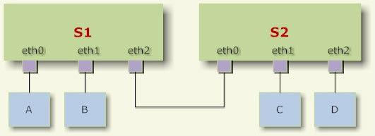
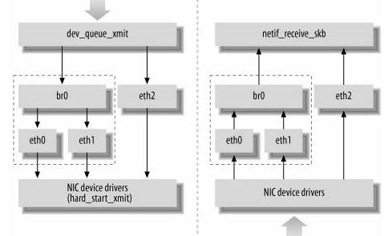

# 网桥原理

[url](http://blog.csdn.net/bailyzheng/article/details/29244963)


## 网桥的原理

### 桥接的概念

> 桥接就是把一台机器上的若干个网络接口“连接”起来。其结果是，其中一个网口收到的报文会被复制给其他网口并发送出去。以使得网口之间的报文能够互相转发。

> 交换机就是这样一个设备，它有若干个网口，并且这些网口是桥接起来的。于是，与交换机相连的若干主机就能够通过交换机的报文转发而互相通信。



```

交换机在报文转发的过程中并不会篡改报文数据，只是做原样复制。然而桥接却并不是在物理层实现的，而是在数据链路层。
交换机能够理解数据链路层的报文，所 以实际上桥接却又不是单纯的报文转发。

交换机会关心填写在报文的数据链路层头部中的Mac地址信息（包括源地址和目的地址），以便了解每个Mac地址所代表的主机都在什么位置（与本交换机的哪 个网口相连。
在报文转发时，交换机就只需要向特定的网口转发即可，从而避免不必要的网络交互。这个就是交换机的“地址学习”。
但是如果交换机遇到一个自 己未学习到的地址，就不会知道这个报文应该从哪个网口转发，则只好将报文转发给所有网口（接收报文的那个网口除外）。

比如主机C向主机A发送一个报文，报文来到了交换机S1的eth2网口上。假设S1刚刚启动，还没有学习到任何地址，则它会将报文转发给eth0和 eth1。
同时，S1会根据报文的源Mac地址，记录下“主机C是通过eth2网口接入的”。于是当主机A向C发送报文时，S1只需要将报文转发到 eth2网口即可。
而当主机D向C发送报文时，假设交换机S2将报文转发到了S1的eth2网口（实际上S2也多半会因为地址学习而不这么做），
则S1会 直接将报文丢弃而不做转发（因为主机C就是从eth2接入的）。

然而，网络拓扑不可能是永不改变的。假设我们将主机B和主机C换个位置，当主机C发出报文时（不管发给谁），交换机S1的eth1口收到报文，
于是交换机 S1会更新其学习到的地址，将原来的“主机C是通过eth2网口接入的”改为“主机C是通过eth1网口接入的”。

但是如果主机C一直不发送报文呢？S1将一直认为“主机C是通过eth2网口接入的”，于是将其他主机发送给C的报文都从eth2转发出去，结果报文就发丢了。
所以交换机的地址学习需要有超时策略。对于交换机S1来说，如果距离最后一次收到主机C的报文已经过去一定时间了（默认为5分钟），
则S1需要忘记 “主机C是通过eth2网口接入的”这件事情。这样一来，发往主机C的报文又会被转发到所有网口上去，而其中从eth1转发出去的报文将被主机C收到。

```

###  linux的桥接实现

```
linux内核支持网口的桥接（目前只支持以太网接口）。但是与单纯的交换机不同，交换机只是一个二层设备，对于接收到的报文，要么转发、要么丢弃。
小型的交换机里面只需要一块交换芯片即可，并不需要CPU。而运行着linux内核的机器本身就是一台主机，有可能就是网络报文的目的地。
其收到的报文除了转 发和丢弃，还可能被送到网络协议栈的上层（网络层），从而被自己消化。

```



```
网桥设备br0绑定了eth0和eth1。对于网络协议栈的上层来说，只看得到br0，因为桥接是在数据链路层实现的，上层不需要关心桥接的细节。于是协 议栈上层需要发送的报文被送到br0，网桥设备的处理代码再来判断报文该被转发到eth0或是eth1，或者两者皆是；反过来，从eth0或从eth1接 收到的报文被提交给网桥的处理代码，在这里会判断报文该转发、丢弃、或提交到协议栈上层。
而有时候eth0、eth1也可能会作为报文的源地址或目的地址，直接参与报文的发送与接收（从而绕过网桥）。

```


### 网桥的功能

> 概括来说，网桥实现最重要的两点：

- MAC学习：学习MAC地址，起初，网桥是没有任何地址与端口的对应关系的，它发送数据，还是得想HUB一样，但是每发送一个数据，
  它都会关心数据包的来源MAC是从自己的哪个端口来的，由于学习，建立地址-端口的对照表（CAM表）。
- 报文转发：每发送一个数据包，网桥都会提取其目的MAC地址，从自己的地址-端口对照表(CAM表)中查找由哪个端口把数据包发送出去。


